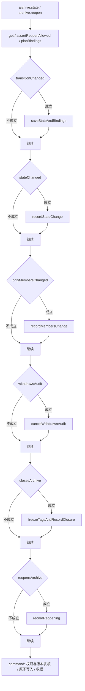

# 档案生命周期规则（自动生成）

运行 `npm run rules:generate` 更新；`npm run rules:check` 检查。不要手工修改本文件。

这是当前分支可执行的档案生命周期行为。1.0.0 将入社身份变化与工作任务推进分开：已入伙保持开启，任务联动由各自的事务入口执行。

## 状态策略

直接读取 [archiveStatePolicy](../../app/shared/archive-states.ts)：网页/MCP 可选状态、状态校验、关闭和负责成员要求均使用该定义。

| 状态 | 档案类型 | 自动关闭 | 要求负责成员 |
| --- | --- | --- | --- |
| 视奸观察 | 人物、组织 | 否 | 否 |
| 个人接触 | 人物、组织 | 否 | 否 |
| 引荐中（待人事组接触） | 人物 | 否 | 是 |
| 人事审核 | 人物 | 否 | 是 |
| 已加入待对接 | 人物 | 否 | 是 |
| 已入伙 | 人物 | 否 | 否 |
| 外部社友 | 人物 | 否 | 否 |
| 组织交流 | 组织 | 否 | 是 |
| 已弃用 | 人物、组织 | 是 | 否 |

## 触发与事务边界

网页 HTTP 与 MCP 的状态修改、显式重开都进入 [transition](../../app/server/archives.ts#L107)。该入口调用下表定义产生 SQL，最后一起提交；规则不单独写库。

- 读取与预校验：[get](../../app/server/archives.ts#L35)（存在性、删除权限、关闭锁定、版本）。
- 关联成员：[planBindings](../../app/server/archives.ts#L91)（存在、冻结及原归属保留；事务内再次校验）。
- 档案事务条件：[guard](../../app/server/archives.ts#L45)。
- 授权、原子提交与重试收据：[command](../../app/server/commands.ts#L21)。
- 重开时词义差异、历史与权限：由上述 transition 调用 [TagState](../../app/server/tag-state.ts) 读取；不在生成器中解释 SQL 或任意函数。
- 取消自动审核任务：[cancel](../../app/server/work-tasks.ts#L115) 通过 [restoreCancelledAudit](../../app/server/work-tasks.ts#L124) 调用 [auditCancellationTarget](../../app/server/rules/archive-lifecycle.ts#L31) 取得本次引荐前的外部关系，复用同一 planArchiveEffects 并在任务事务中提交。历史无法确认或档案已变更身份时不猜测退回状态。

以下条件和结果来自实际参与执行的函数引用及函数体。源码链接供追溯，不把人工说明作为规则来源。

## 按顺序执行的联动

| 标识 | 条件函数 | 结果函数 |
| --- | --- | --- |
| save-state | [transitionChanged](../../app/server/rules/archive-lifecycle.ts#L21) | [saveStateAndBindings](../../app/server/rules/archive-lifecycle.ts#L49) |
| state-history | [stateChanged](../../app/server/rules/archive-lifecycle.ts#L24) | [recordStateChange](../../app/server/rules/archive-lifecycle.ts#L54) |
| members-history | [onlyMembersChanged](../../app/server/rules/archive-lifecycle.ts#L25) | [recordMembersChange](../../app/server/rules/archive-lifecycle.ts#L57) |
| withdraw-audit | [withdrawsAudit](../../app/server/rules/archive-lifecycle.ts#L28) | [cancelWithdrawnAudit](../../app/server/rules/archive-lifecycle.ts#L37) |
| close | [closesArchive](../../app/server/rules/archive-lifecycle.ts#L26) | [freezeTagsAndRecordClosure](../../app/server/rules/archive-lifecycle.ts#L60) |
| reopen | [reopensArchive](../../app/server/rules/archive-lifecycle.ts#L27) | [recordReopening](../../app/server/rules/archive-lifecycle.ts#L64) |



## 执行条件与结果的源码

### assertReopenAllowed

[assertReopenAllowed](../../app/server/rules/archive-lifecycle.ts#L14)

```javascript
function assertReopenAllowed(c) {
    if (c.reopen && (!c.old.closed || isClosedState(c.status))) throw new Failure(409, 'INVALID_REOPEN', '只能显式重新开启已关闭档案，并选择开启类状态');
}
```

### assertStateAndResponsibility

[assertStateAndResponsibility](../../app/server/rules/archive-lifecycle.ts#L17)

```javascript
function assertStateAndResponsibility(type, status, ids) {
    if (!statesFor(type).includes(status)) throw new Failure(400, 'INVALID_STATE', '该状态不属于这类档案');
    if (isWorkState(type, status) && ids.length === 0) throw new Failure(400, 'RESPONSIBLE_REQUIRED', '工作状态必须明确选择至少一名负责成员');
}
```

### transitionChanged

[transitionChanged](../../app/server/rules/archive-lifecycle.ts#L21)

```javascript
function transitionChanged(c) {
    return c.reopen || c.status !== c.old.status || JSON.stringify(c.old.members.map((m)=>m.id).sort()) !== JSON.stringify(c.memberIds);
}
```

### planArchiveEffects

[planArchiveEffects](../../app/server/rules/archive-lifecycle.ts#L79)

```javascript
function planArchiveEffects(context) {
    return archiveTransitionRules.flatMap((rule)=>rule.when(context) ? rule.apply(context) : []);
}
```

### auditCancellationTarget

[auditCancellationTarget](../../app/server/rules/archive-lifecycle.ts#L31)

```javascript
function auditCancellationTarget(task, old, change) {
    if (task.kind !== 'audit' || task.source !== 'rule' || old.type !== 'person' || old.closed || old.deleted || old.status !== '人事审核' || change?.after?.task_id !== task.id) return null;
    const previous = change.before?.status;
    return typeof previous === 'string' && [
        '视奸观察',
        '个人接触',
        '外部社友'
    ].includes(previous) ? previous : null;
}
```

### saveStateAndBindings

[saveStateAndBindings](../../app/server/rules/archive-lifecycle.ts#L49)

```javascript
function saveStateAndBindings(c) {
    const closed = isClosedState(c.status);
    return [
        c.stmt('UPDATE archives SET status=?,closed=?,last_open_status=?,version=version+1,updated_at=? WHERE id=?', c.status, closed ? 1 : 0, closed ? c.old.status : c.old.last_open_status, c.at, c.old.id),
        c.stmt('DELETE FROM archive_bindings WHERE archive_id=? AND status=?', c.old.id, c.status),
        ...c.bindings
    ];
}
```

### stateChanged

[stateChanged](../../app/server/rules/archive-lifecycle.ts#L24)

```javascript
function stateChanged(c) {
    return c.status !== c.old.status;
}
```

### recordStateChange

[recordStateChange](../../app/server/rules/archive-lifecycle.ts#L54)

```javascript
function recordStateChange(c) {
    return [
        c.event(c.old.id, 'archive.state_changed', {
            status: c.old.status,
            members: c.old.members
        }, {
            status: c.status,
            members: c.members
        }, c.at)
    ];
}
```

### onlyMembersChanged

[onlyMembersChanged](../../app/server/rules/archive-lifecycle.ts#L25)

```javascript
function onlyMembersChanged(c) {
    return transitionChanged(c) && !stateChanged(c);
}
```

### recordMembersChange

[recordMembersChange](../../app/server/rules/archive-lifecycle.ts#L57)

```javascript
function recordMembersChange(c) {
    return [
        c.event(c.old.id, 'archive.members_changed', {
            status: c.old.status,
            members: c.old.members
        }, {
            status: c.status,
            members: c.members
        }, c.at)
    ];
}
```

### withdrawsAudit

[withdrawsAudit](../../app/server/rules/archive-lifecycle.ts#L28)

```javascript
function withdrawsAudit(c) {
    return c.old.type === 'person' && stateChanged(c) && [
        '引荐中（待人事组接触）',
        '人事审核'
    ].includes(c.old.status) && [
        '视奸观察',
        '个人接触',
        '外部社友',
        '已弃用'
    ].includes(c.status);
}
```

### cancelWithdrawnAudit

[cancelWithdrawnAudit](../../app/server/rules/archive-lifecycle.ts#L37)

```javascript
function cancelWithdrawnAudit(c) {
    const reason = `档案从${c.old.status}转为${c.status}，撤回人事审核`;
    return [
        c.stmt(`INSERT INTO work_task_events(id,task_id,actor_id,source,kind,before_json,after_json,reason,created_at)
   SELECT lower(hex(randomblob(16))),id,?,?,'task.cancelled',
    json_object('status',status,'owner_id',owner_id,'version',version),
    json_object('status','cancelled','owner_id',owner_id,'version',version+1),?,?
   FROM work_tasks WHERE archive_id=? AND kind='audit' AND source='rule' AND status='open'`, c.actorId, c.source, reason, c.at, c.old.id),
        c.stmt("UPDATE work_tasks SET status='cancelled',closed_reason=?,updated_at=?,version=version+1 WHERE archive_id=? AND kind='audit' AND source='rule' AND status='open'", reason, c.at, c.old.id)
    ];
}
```

### closesArchive

[closesArchive](../../app/server/rules/archive-lifecycle.ts#L26)

```javascript
function closesArchive(c) {
    return transitionChanged(c) && isClosedState(c.status);
}
```

### freezeTagsAndRecordClosure

[freezeTagsAndRecordClosure](../../app/server/rules/archive-lifecycle.ts#L60)

```javascript
function freezeTagsAndRecordClosure(c) {
    return [
        c.tags.snapshot(c.old.id, c.old.version + 1),
        c.stmt('UPDATE archives SET tag_snapshot_version=? WHERE id=?', c.old.version + 1, c.old.id),
        c.event(c.old.id, 'archive.closed', {
            status: c.old.status
        }, {
            status: c.status,
            tag_snapshot_version: c.old.version + 1
        }, c.at)
    ];
}
```

### reopensArchive

[reopensArchive](../../app/server/rules/archive-lifecycle.ts#L27)

```javascript
function reopensArchive(c) {
    return c.reopen;
}
```

### recordReopening

[recordReopening](../../app/server/rules/archive-lifecycle.ts#L64)

```javascript
function recordReopening(c) {
    return [
        c.event(c.old.id, 'archive.reopened', {
            status: c.old.status
        }, {
            status: c.status
        }, c.at)
    ];
}
```
