# 档案生命周期规则（自动生成）

运行 `npm run rules:generate` 更新；`npm run rules:check` 检查。不要手工修改本文件。

这是当前分支可执行的档案生命周期行为。1.0.0 将入社身份变化与工作任务推进分开：已入伙保持开启，任务联动由各自的事务入口执行。

## 状态策略

直接读取 [archiveStatePolicy](../../app/shared/archive-states.ts)：网页/MCP 可选状态、状态校验、关闭和负责成员要求均使用该定义。

| 状态 | 档案类型 | 自动关闭 | 要求负责成员 |
| --- | --- | --- | --- |
| 视奸观察 | 人物、组织 | 否 | 否 |
| 个人接触 | 人物、组织 | 否 | 否 |
| 引荐中（待人事组接触） | 人物 | 否 | 是 |
| 人事审核 | 人物 | 否 | 是 |
| 已加入待对接 | 人物 | 否 | 是 |
| 已入伙 | 人物 | 否 | 否 |
| 外部社友 | 人物 | 否 | 否 |
| 组织交流 | 组织 | 否 | 是 |
| 已弃用 | 人物、组织 | 是 | 否 |

## 共同契约

模块：`archive-lifecycle`；计划器：[planRules](../../app/server/rules/contract.ts#L29)。计划按规则顺序返回 steps 和 statements，不执行提交。

触发入口：[transition](../../app/server/archives.ts#L116)、[restoreCancelledAudit](../../app/server/work-tasks.ts#L278)。
事务提交：[command](../../app/server/commands.ts#L21)；版本保护：[guard](../../app/server/archives.ts#L47)。
幂等边界：command 请求收据；transitionChanged 排除无变化操作；档案版本事务校验；任务取消仅匹配 open，消息沿用现有唯一约束。
失败边界：预校验失败不提交；事务内权限或版本冲突、SQL 失败整体回滚。保留现有行为，不新增任务轮次语义。

- 验证：[tests/archive-lifecycle.test.mjs](../../tests/archive-lifecycle.test.mjs)
- 验证：[tests/monthly-work-tasks.test.mjs](../../tests/monthly-work-tasks.test.mjs)
- 验证：[tests/work-tasks.test.mjs](../../tests/work-tasks.test.mjs)
- 验证：[tests/business-rule-view.test.mjs](../../tests/business-rule-view.test.mjs)
- 验证：[tests/rule-contract.test.ts](../../tests/rule-contract.test.ts)

这些边界说明是模块内的维护元数据，并非自动推导的证明；条件、实际影响及顺序以以下执行函数与行为测试为准。

## 触发与事务边界

网页 HTTP 与 MCP 的状态修改、显式重开都进入 [transition](../../app/server/archives.ts#L116)。该入口调用下表定义产生 SQL，最后一起提交；规则不单独写库。

- 读取与预校验：[get](../../app/server/archives.ts#L37)（存在性、删除权限、关闭锁定、版本）。
- 关联成员：[planBindings](../../app/server/archives.ts#L100)（存在、冻结及原归属保留；事务内再次校验）。
- 档案事务条件：[guard](../../app/server/archives.ts#L47)。
- 授权、原子提交与重试收据：[command](../../app/server/commands.ts#L21)。
- 重开时词义差异、历史与权限：由上述 transition 调用 [TagState](../../app/server/tag-state.ts) 读取；不在生成器中解释 SQL 或任意函数。
- 取消自动审核任务：[cancel](../../app/server/work-tasks.ts#L198) 通过 [restoreCancelledAudit](../../app/server/work-tasks.ts#L278) 调用 [auditCancellationTarget](../../app/server/rules/archive-lifecycle.ts#L32) 取得本次引荐前的外部关系，复用同一 planArchiveEffects 并在任务事务中提交。历史无法确认或档案已变更身份时不猜测退回状态。

以下条件和结果来自实际参与执行的函数引用及函数体。源码链接供追溯，不把人工说明作为规则来源。

## 按顺序执行的联动

| 标识 | 条件函数 | 结果函数 |
| --- | --- | --- |
| save-state | [transitionChanged](../../app/server/rules/archive-lifecycle.ts#L22) | [saveStateAndBindings](../../app/server/rules/archive-lifecycle.ts#L88) |
| state-history | [stateChanged](../../app/server/rules/archive-lifecycle.ts#L25) | [recordStateChange](../../app/server/rules/archive-lifecycle.ts#L93) |
| members-history | [onlyMembersChanged](../../app/server/rules/archive-lifecycle.ts#L26) | [recordMembersChange](../../app/server/rules/archive-lifecycle.ts#L96) |
| withdraw-audit | [withdrawsAudit](../../app/server/rules/archive-lifecycle.ts#L29) | [cancelWithdrawnAudit](../../app/server/rules/archive-lifecycle.ts#L38) |
| cancel-inapplicable-tasks | [cancelInapplicableTasksWhen](../../app/server/rules/archive-lifecycle.ts#L80) | [cancelsInapplicableTasks](../../app/server/rules/archive-lifecycle.ts#L50) |
| notify-manual-tasks | [notifyManualTasksWhen](../../app/server/rules/archive-lifecycle.ts#L84) | [notifyManualTasks](../../app/server/rules/archive-lifecycle.ts#L65) |
| close | [closesArchive](../../app/server/rules/archive-lifecycle.ts#L27) | [freezeTagsAndRecordClosure](../../app/server/rules/archive-lifecycle.ts#L99) |
| reopen | [reopensArchive](../../app/server/rules/archive-lifecycle.ts#L28) | [recordReopening](../../app/server/rules/archive-lifecycle.ts#L103) |

```mermaid
flowchart TD
  start["archive.state / archive.reopen"] --> checks["get / assertReopenAllowed / planBindings"]
  checks --> cond0{"transitionChanged"}
  cond0 -->|成立| effect0["saveStateAndBindings"]
  cond0 -->|不成立| next0["继续"]
  effect0 --> next0
  next0 --> cond1{"stateChanged"}
  cond1 -->|成立| effect1["recordStateChange"]
  cond1 -->|不成立| next1["继续"]
  effect1 --> next1
  next1 --> cond2{"onlyMembersChanged"}
  cond2 -->|成立| effect2["recordMembersChange"]
  cond2 -->|不成立| next2["继续"]
  effect2 --> next2
  next2 --> cond3{"withdrawsAudit"}
  cond3 -->|成立| effect3["cancelWithdrawnAudit"]
  cond3 -->|不成立| next3["继续"]
  effect3 --> next3
  next3 --> cond4{"cancelInapplicableTasksWhen"}
  cond4 -->|成立| effect4["cancelsInapplicableTasks"]
  cond4 -->|不成立| next4["继续"]
  effect4 --> next4
  next4 --> cond5{"notifyManualTasksWhen"}
  cond5 -->|成立| effect5["notifyManualTasks"]
  cond5 -->|不成立| next5["继续"]
  effect5 --> next5
  next5 --> cond6{"closesArchive"}
  cond6 -->|成立| effect6["freezeTagsAndRecordClosure"]
  cond6 -->|不成立| next6["继续"]
  effect6 --> next6
  next6 --> cond7{"reopensArchive"}
  cond7 -->|成立| effect7["recordReopening"]
  cond7 -->|不成立| next7["继续"]
  effect7 --> next7
  next7 --> batch["command: 权限与版本复核 / 原子写入 / 收据"]
```



## 执行条件与结果的源码

### assertReopenAllowed

[assertReopenAllowed](../../app/server/rules/archive-lifecycle.ts#L15)

```javascript
function assertReopenAllowed(c) {
    if (c.reopen && (!c.old.closed || isClosedState(c.status))) throw new Failure(409, 'INVALID_REOPEN', '只能显式重新开启已关闭档案，并选择开启类状态');
}
```

### assertStateAndResponsibility

[assertStateAndResponsibility](../../app/server/rules/archive-lifecycle.ts#L18)

```javascript
function assertStateAndResponsibility(type, status, ids) {
    if (!statesFor(type).includes(status)) throw new Failure(400, 'INVALID_STATE', '该状态不属于这类档案');
    if (isWorkState(type, status) && ids.length === 0) throw new Failure(400, 'RESPONSIBLE_REQUIRED', '工作状态必须明确选择至少一名负责成员');
}
```

### transitionChanged

[transitionChanged](../../app/server/rules/archive-lifecycle.ts#L22)

```javascript
function transitionChanged(c) {
    return c.reopen || c.status !== c.old.status || JSON.stringify(c.old.members.map((m)=>m.id).sort()) !== JSON.stringify(c.memberIds);
}
```

### planArchiveEffects

[planArchiveEffects](../../app/server/rules/archive-lifecycle.ts#L133)

```javascript
function planArchiveEffects(context) {
    return planRules(archiveLifecycleModule, context).statements;
}
```

### auditCancellationTarget

[auditCancellationTarget](../../app/server/rules/archive-lifecycle.ts#L32)

```javascript
function auditCancellationTarget(task, old, change) {
    if (task.kind !== 'audit' || task.source !== 'rule' || old.type !== 'person' || old.closed || old.deleted || old.status !== '人事审核' || change?.after?.task_id !== task.id) return null;
    const previous = change.before?.status;
    return typeof previous === 'string' && [
        '视奸观察',
        '个人接触',
        '外部社友'
    ].includes(previous) ? previous : null;
}
```

### saveStateAndBindings

[saveStateAndBindings](../../app/server/rules/archive-lifecycle.ts#L88)

```javascript
function saveStateAndBindings(c) {
    const closed = isClosedState(c.status);
    return [
        c.stmt('UPDATE archives SET status=?,closed=?,last_open_status=?,version=version+1,updated_at=? WHERE id=?', c.status, closed ? 1 : 0, closed ? c.old.status : c.old.last_open_status, c.at, c.old.id),
        c.stmt('DELETE FROM archive_bindings WHERE archive_id=? AND status=?', c.old.id, c.status),
        ...c.bindings
    ];
}
```

### stateChanged

[stateChanged](../../app/server/rules/archive-lifecycle.ts#L25)

```javascript
function stateChanged(c) {
    return c.status !== c.old.status;
}
```

### recordStateChange

[recordStateChange](../../app/server/rules/archive-lifecycle.ts#L93)

```javascript
function recordStateChange(c) {
    return [
        c.event(c.old.id, 'archive.state_changed', {
            status: c.old.status,
            members: c.old.members
        }, {
            status: c.status,
            members: c.members
        }, c.at)
    ];
}
```

### onlyMembersChanged

[onlyMembersChanged](../../app/server/rules/archive-lifecycle.ts#L26)

```javascript
function onlyMembersChanged(c) {
    return transitionChanged(c) && !stateChanged(c);
}
```

### recordMembersChange

[recordMembersChange](../../app/server/rules/archive-lifecycle.ts#L96)

```javascript
function recordMembersChange(c) {
    return [
        c.event(c.old.id, 'archive.members_changed', {
            status: c.old.status,
            members: c.old.members
        }, {
            status: c.status,
            members: c.members
        }, c.at)
    ];
}
```

### withdrawsAudit

[withdrawsAudit](../../app/server/rules/archive-lifecycle.ts#L29)

```javascript
function withdrawsAudit(c) {
    return c.old.type === 'person' && stateChanged(c) && [
        '引荐中（待人事组接触）',
        '人事审核'
    ].includes(c.old.status) && [
        '视奸观察',
        '个人接触',
        '外部社友',
        '已弃用'
    ].includes(c.status);
}
```

### cancelWithdrawnAudit

[cancelWithdrawnAudit](../../app/server/rules/archive-lifecycle.ts#L38)

```javascript
function cancelWithdrawnAudit(c) {
    const reason = `档案从${c.old.status}转为${c.status}，撤回人事审核`;
    return [
        c.stmt(`INSERT INTO work_task_events(id,task_id,actor_id,source,kind,before_json,after_json,reason,created_at)
   SELECT lower(hex(randomblob(16))),id,?,?,'task.cancelled',
    json_object('status',status,'owner_id',owner_id,'version',version),
    json_object('status','cancelled','owner_id',owner_id,'version',version+1),?,?
   FROM work_tasks WHERE archive_id=? AND kind='audit' AND source='rule' AND status='open'`, c.actorId, c.source, reason, c.at, c.old.id),
        c.stmt("UPDATE work_tasks SET status='cancelled',closed_reason=?,updated_at=?,version=version+1 WHERE archive_id=? AND kind='audit' AND source='rule' AND status='open'", reason, c.at, c.old.id)
    ];
}
```

### cancelInapplicableTasksWhen

[cancelInapplicableTasksWhen](../../app/server/rules/archive-lifecycle.ts#L80)

```javascript
function cancelInapplicableTasksWhen(c) {
    return stateChanged(c) && (c.old.type === 'person' && memberStatuses.includes(c.old.status) && !memberStatuses.includes(c.status) || isClosedState(c.status));
}
```

### cancelsInapplicableTasks

[cancelsInapplicableTasks](../../app/server/rules/archive-lifecycle.ts#L50)

```javascript
function cancelsInapplicableTasks(c) {
    const leavesMembership = c.old.type === 'person' && memberStatuses.includes(c.old.status) && !memberStatuses.includes(c.status);
    const kinds = isClosedState(c.status) ? "'audit','monthly','onboarding'" : leavesMembership ? "'monthly','onboarding'" : null;
    if (!kinds) return [];
    const reason = `档案从${c.old.status}变为${c.status}，关联工作不再适用`;
    return [
        c.stmt(`INSERT INTO work_task_events(id,task_id,actor_id,source,kind,before_json,after_json,reason,created_at)
   SELECT lower(hex(randomblob(16))),id,?,?,'task.cancelled',
    json_object('status',status,'owner_id',owner_id,'version',version),
    json_object('status','cancelled','owner_id',owner_id,'version',version+1),?,?
   FROM work_tasks WHERE archive_id=? AND source='rule' AND kind IN (${kinds}) AND status='open'`, c.actorId, c.source, reason, c.at, c.old.id),
        c.stmt(`UPDATE work_tasks SET status='cancelled',closed_reason=?,updated_at=?,version=version+1 WHERE archive_id=? AND source='rule' AND kind IN (${kinds}) AND status='open'`, reason, c.at, c.old.id)
    ];
}
```

### notifyManualTasksWhen

[notifyManualTasksWhen](../../app/server/rules/archive-lifecycle.ts#L84)

```javascript
function notifyManualTasksWhen(c) {
    return stateChanged(c) && c.old.type === 'person';
}
```

### notifyManualTasks

[notifyManualTasks](../../app/server/rules/archive-lifecycle.ts#L65)

```javascript
function notifyManualTasks(c) {
    if (!stateChanged(c) || c.old.type !== 'person') return [];
    const reason = `档案状态已从${c.old.status}变为${c.status}，请负责人核对合作任务是否继续`;
    return [
        c.stmt(`INSERT INTO work_task_events(id,task_id,actor_id,source,kind,before_json,after_json,reason,created_at)
   SELECT lower(hex(randomblob(16))),id,?,?,'task.archive_status_changed',
    json_object('archive_status',?),json_object('archive_status',?,'owner_id',owner_id),?,?
   FROM work_tasks WHERE archive_id=? AND status='open' AND kind='cooperation'`, c.actorId, c.source, c.old.status, c.status, reason, c.at, c.old.id),
        c.stmt(`INSERT INTO messages(id,recipient_id,kind,task_id,object_type,object_id,title,body,task_version,deadline_at,created_at)
   SELECT lower(hex(randomblob(16))),owner_id,'archive_status_changed',id,'work_task',id,'关联档案状态已变化',?,version,deadline_at,?
   FROM work_tasks t WHERE archive_id=? AND status='open' AND kind='cooperation' AND owner_id IS NOT NULL
   ON CONFLICT(recipient_id,kind,object_type,object_id,deadline_at) DO UPDATE SET body=excluded.body,task_version=excluded.task_version,created_at=excluded.created_at,read_at=NULL`, reason, c.at, c.old.id)
    ];
}
```

### closesArchive

[closesArchive](../../app/server/rules/archive-lifecycle.ts#L27)

```javascript
function closesArchive(c) {
    return transitionChanged(c) && isClosedState(c.status);
}
```

### freezeTagsAndRecordClosure

[freezeTagsAndRecordClosure](../../app/server/rules/archive-lifecycle.ts#L99)

```javascript
function freezeTagsAndRecordClosure(c) {
    return [
        c.tags.snapshot(c.old.id, c.old.version + 1),
        c.stmt('UPDATE archives SET tag_snapshot_version=? WHERE id=?', c.old.version + 1, c.old.id),
        c.event(c.old.id, 'archive.closed', {
            status: c.old.status
        }, {
            status: c.status,
            tag_snapshot_version: c.old.version + 1
        }, c.at)
    ];
}
```

### reopensArchive

[reopensArchive](../../app/server/rules/archive-lifecycle.ts#L28)

```javascript
function reopensArchive(c) {
    return c.reopen;
}
```

### recordReopening

[recordReopening](../../app/server/rules/archive-lifecycle.ts#L103)

```javascript
function recordReopening(c) {
    return [
        c.event(c.old.id, 'archive.reopened', {
            status: c.old.status
        }, {
            status: c.status
        }, c.at)
    ];
}
```
