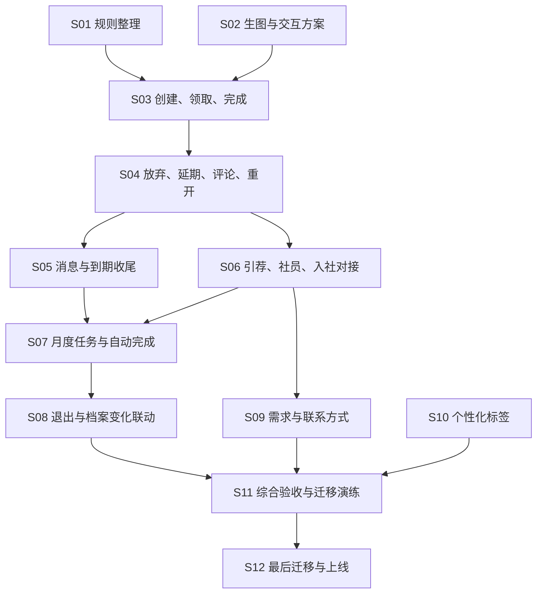

# 1.0.0 开发交接：从这里开始

产品要求已经对齐，功能尚未实施。当前线上仍为 0.1.1。接手者可以配合 AI 按下列 Issues 逐项完成；每项都写了目的、完整路径、验收和前置依赖。

**[PRD · 1.0.0](../../PRD-1.0.0.md) · [版本总览 #54](https://github.com/BreakfastDaPaiDang/commie-talent-scout/issues/54) · [v1.0.0 里程碑](https://github.com/BreakfastDaPaiDang/commie-talent-scout/milestone/3)**

## 第一次接手，先做这四步

1. 读本文和 [1.0.0 PRD](../../PRD-1.0.0.md) 的第 1—3、16 节，了解目标、权限和本版不做什么。处理具体任务时再读其引用章节，不必一次背完整份 PRD。
2. 阅读根目录 [AGENTS.md](../../../AGENTS.md) 和 [开发说明](../../development.md)，启动本地环境。按既有脚本准备虚构测试数据，不复制生产数据来练习。
3. 选一项前置依赖已完成的 Issue。想先熟悉项目，可以从 [#64](https://github.com/BreakfastDaPaiDang/commie-talent-scout/issues/64) 个性化标签开始；主线从 [#55](https://github.com/BreakfastDaPaiDang/commie-talent-scout/issues/55) 规则整理开始；[#56](https://github.com/BreakfastDaPaiDang/commie-talent-scout/issues/56) 视觉方案也能先做。
4. 让 AI 先解释现有相关路径，再完成当前 Issue 并演示验收。验收结果清楚后再接下一项，不一次性要求 AI 做完整个版本。

`ready-for-agent` 表示该项要求已经足够清楚，不表示前置任务已完成。总览标记 `ready-for-human` 是方便接手人统筹版本，并不增加产品审批关卡。进度以 GitHub Issue 和里程碑为准，本文不另外维护完成勾选。

## 文档怎么找

```text
docs/
  PRD-0.1.1.md                当前线上规则，保留旧版基线
  PRD-1.0.0.md                新版唯一需求正文
  releases/
    0.1.1.md                 已发布版本的专题说明
    1.0.0/
      README.md              本交接入口、Issue 路线与验收索引
      history/decisions.md   已归档的前期讨论，通常不必读
  adr/
    0014-executable-business-rules.md
```

| 想知道什么 | 读哪里 |
| --- | --- |
| 新版应该做成什么样 | [PRD · 1.0.0](../../PRD-1.0.0.md)，按 Issue 指定章节读 |
| 线上现在怎么工作 | [PRD · 0.1.1](../../PRD-0.1.1.md)及[成员指南](../../member-guide.md) |
| 概念和术语 | [CONTEXT.md](../../../CONTEXT.md)，注意“1.0.0 已确认术语”与现行旧规则的区别 |
| 为什么集中规则、如何生成视图 | [ADR 0014](../../adr/0014-executable-business-rules.md)及[共享业务层 ADR](../../adr/0003-shared-worker-business-layer.md) |
| 怎么启动、测试和部署 | [开发说明](../../development.md)、[部署与恢复](../../operations.md) |
| 原型与正式页面怎么保持一致 | [前端约定](../../agents/frontend.md) |
| 旧讨论的来龙去脉 | [归档备忘](./history/decisions.md)，只供追溯，不覆盖 PRD |

Issue 是具体工作与验收清单，PRD 是需求正文，ADR 是架构原因。不要再为每个 Issue 复制完整 PRD，或另建一份手工同步的任务进度表。

## 实施路线

共 **12 项实施 Issue**。S01 是必要的前置整理，S02 是用户明确要求的设计前置；其余功能项均要贯通所需存储、业务、网页、MCP 和验证。

| 编号 / Issue | 完成什么 | 需要先完成 |
| --- | --- | --- |
| S01 · [#55](https://github.com/BreakfastDaPaiDang/commie-talent-scout/issues/55) | 集中可执行业务规则，验证现有档案开关行为不变 | 无 |
| S02 · [#56](https://github.com/BreakfastDaPaiDang/commie-talent-scout/issues/56) | 从生图意向到可操作的任务看板与新版导航方案 | 无 |
| S03 · [#57](https://github.com/BreakfastDaPaiDang/commie-talent-scout/issues/57) | 通过网页和 MCP 创建、领取并完成一项人事任务 | [#55](https://github.com/BreakfastDaPaiDang/commie-talent-scout/issues/55)、[#56](https://github.com/BreakfastDaPaiDang/commie-talent-scout/issues/56) |
| S04 · [#58](https://github.com/BreakfastDaPaiDang/commie-talent-scout/issues/58) | 支持主动放弃、延期、重开与任务评论历史 | [#57](https://github.com/BreakfastDaPaiDang/commie-talent-scout/issues/57) |
| S05 · [#59](https://github.com/BreakfastDaPaiDang/commie-talent-scout/issues/59) | 升级消息提醒页，并按期限提醒和自动结束任务 | [#58](https://github.com/BreakfastDaPaiDang/commie-talent-scout/issues/58) |
| S06 · [#60](https://github.com/BreakfastDaPaiDang/commie-talent-scout/issues/60) | 打通引荐审核、入社转档与入社对接 | [#58](https://github.com/BreakfastDaPaiDang/commie-talent-scout/issues/58) |
| S07 · [#61](https://github.com/BreakfastDaPaiDang/commie-talent-scout/issues/61) | 生成独立月度任务，并支持留档时完成关联任务 | [#59](https://github.com/BreakfastDaPaiDang/commie-talent-scout/issues/59)、[#60](https://github.com/BreakfastDaPaiDang/commie-talent-scout/issues/60) |
| S08 · [#62](https://github.com/BreakfastDaPaiDang/commie-talent-scout/issues/62) | 处理转为社友、退出及档案变化引起的任务联动 | [#61](https://github.com/BreakfastDaPaiDang/commie-talent-scout/issues/61) |
| S09 · [#63](https://github.com/BreakfastDaPaiDang/commie-talent-scout/issues/63) | 让档案和 Agent 记录当前需求，并提醒补充联系方式 | [#60](https://github.com/BreakfastDaPaiDang/commie-talent-scout/issues/60) |
| S10 · [#64](https://github.com/BreakfastDaPaiDang/commie-talent-scout/issues/64) | 允许个性化标签，并保持观察与依据的完整读取 | 无 |
| S11 · [#65](https://github.com/BreakfastDaPaiDang/commie-talent-scout/issues/65) | 在隔离环境完成 1.0.0 全流程验收与迁移演练 | [#55](https://github.com/BreakfastDaPaiDang/commie-talent-scout/issues/55)、[#56](https://github.com/BreakfastDaPaiDang/commie-talent-scout/issues/56)、[#57](https://github.com/BreakfastDaPaiDang/commie-talent-scout/issues/57)、[#58](https://github.com/BreakfastDaPaiDang/commie-talent-scout/issues/58)、[#59](https://github.com/BreakfastDaPaiDang/commie-talent-scout/issues/59)、[#60](https://github.com/BreakfastDaPaiDang/commie-talent-scout/issues/60)、[#61](https://github.com/BreakfastDaPaiDang/commie-talent-scout/issues/61)、[#62](https://github.com/BreakfastDaPaiDang/commie-talent-scout/issues/62)、[#63](https://github.com/BreakfastDaPaiDang/commie-talent-scout/issues/63)、[#64](https://github.com/BreakfastDaPaiDang/commie-talent-scout/issues/64) |
| S12 · [#66](https://github.com/BreakfastDaPaiDang/commie-talent-scout/issues/66) | 最后执行旧档案迁移、首批周期任务生成与正式上线核对 | [#65](https://github.com/BreakfastDaPaiDang/commie-talent-scout/issues/65) |

顺着编号执行最容易理解；依赖已满足的项也可以先做。S10 无功能前置，适合作为第一次练习。S11 必须等 S01—S10 全部完成，S12 必须最后执行。



图中省略已经通过路径传递的依赖；具体阻塞以 Issue 正文和上表为准。

## 和 AI 一起做一项任务

可把下面这段交给 AI，将 Issue 号换成当前要做的任务：

```text
请接手康米巨星猎头系统的 Issue #编号。
先阅读 AGENTS.md、docs/releases/1.0.0/README.md、该 Issue 正文和评论，
核对前置 Issue 是否已经完成，再读 PRD-1.0.0.md 中对应章节。

先用几句话解释现有代码怎样完成相关业务、这次会改变什么、怎样验证；
然后只实施这一项，从用户操作一直做到持久化、网页和 MCP 结果一致。
默认值和小的可逆细节按 PRD 第 15 节处理，记录选择；
遇到影响核心范围或权限的问题再提出，不擅自扩大到整版重写。

结束时给我：可演示的操作路径、实际验证结果、文档更新、遗留限制。
留意 main 会自动发布正式站，未兼容的功能按版本集成方案推进。
```

如果想练习理解代码，可以先让 AI 带着走一遍现有路径，并说明每个改动解决哪个验收条件。不要以“代码生成了”或“页面有按钮”作为完成标准。

## 代码入口地图

| 位置 | 用途 |
| --- | --- |
| [app/server](../../../app/server) | 网页和 MCP 共用的业务、权限、事务及协议入口 |
| [app/shared](../../../app/shared) | 跨端共享的定义与纯逻辑 |
| [app/ui](../../../app/ui) | 已确认共享界面；原型和正式站都用这里 |
| [app/client](../../../app/client) | 正式接口、会话和页面数据接入 |
| [prototypes/frontend](../../../prototypes/frontend) | 虚构数据的交互预览，不是另一套正式应用 |
| [migrations](../../../migrations) | 数据结构迁移，执行时区分本地、测试与正式环境 |
| [tests](../../../tests)、[scripts](../../../scripts) | 行为测试、界面和真实接口验证、发布与恢复工具 |

已有的 `mcp-tasks`、`task-review` 是 **Agent 调用上下文及审阅**，不是新的人事任务系统。前者有请求留存期限，新任务历史不能随它到期被清理。

`spikes/` 是历史技术验证，不参与正式构建；常规开发从正式应用入口开始。本地可能有其他人的未提交改动，先看 `git status`，只提交当前任务相关文件。

## 这些决定不要重新猜

- 社员身份与登录账号分开；同一个人的档案从外部到入社、退出都延续。
- 任务只由本人接取，一项任务只有一名当前负责人；放弃回到待领取，不算失败。
- 任务关闭后只读；重新开启要有新期限；到期没有宽限期。
- 上月与下月各是一个任务，允许补作业；同月份的重复生成必须去重。
- 接取者可以如实完成，包括目前联系不到；不得加上“必须有回复／新观察才能完成”的硬门槛。
- 交付要求是把结果写进档案，任务评论不重复存一份；自动完成减少操作，不成为唯一完成入口。
- 统计界面暂不改，不做自动考核；新任务由大家主动从看板领取。
- 先用生图探索看板意向，再落实共享界面和真实交互；不拿生成图替代完整界面验收。
- 规则视图从实际可执行定义生成，不手工维护第二份规则表。

## 一项工作怎样算完成

1. 能用虚构数据演示 Issue 中的完整路径，网页与 MCP 的权限和结果一致。
2. 完成该项适用的类型检查、行为测试和构建；有界面变化时，完成历史原型对照、完整展开态及真实接口验证。具体命令按[开发说明](../../development.md)，避免机械地重复所有高成本外部测试。
3. 覆盖验收中的重复、并发、关闭、冻结、权限等实际风险；失败要解决或明确说明，不能只记录通过的部分。
4. 在 PR 或 Issue 中记录验证命令／环境、脱敏结果、默认值与限制；修改了操作方式就更新相应说明。
5. 不提交真实资料、凭据、私有备份或大批临时产物；临时验证放在已忽略的 `tmp/verification`，公开证据整理到验证文档。

## 合并、发布与最后迁移

当前 `main` 的推送会触发生产自动发布。开发使用功能分支和 PR；尚不兼容旧数据的改动应进入 1.0.0 集成分支或既定发布门控，具体方式由 S01 先说明。不能把“已经合并”当成“生产已具备完整新规则”。

S11 在隔离环境完成全流程和迁移演练；S12 才核对真实档案、执行业务转换、生成正式首批周期任务并发布。必要结构迁移和兼容代码仍按演练过的顺序处理，并非一律拖到最后才建表。

迁移前核对真实身份和责任，尤其不能从旧档案多个关联人中随便选一人。首批任务可提前按十月生成；若实际发布日期变化，重新确认起始月，不盲目补九月任务。

全部上线核对通过后，接手人再关闭总览 #54。本次文档与 Issue 发布不修改软件版本号，也不意味着 1.0.0 已上线。

<details>
<summary>用户故事与验收覆盖索引（核对是否漏项时展开）</summary>

编号来自 [PRD](../../PRD-1.0.0.md) 第 12、13 节。56 条用户故事、32 项验收均已分配；跨模块场景由功能项各自验证，再在 S11 汇总。S12 的正式执行不能被 S11 的演练替代。

| Issue | 用户故事 | 验收场景 |
| --- | --- | --- |
| S01 · [#55](https://github.com/BreakfastDaPaiDang/commie-talent-scout/issues/55) | 50、51 | A25、A27 |
| S02 · [#56](https://github.com/BreakfastDaPaiDang/commie-talent-scout/issues/56) | 1、21、31、35、45、52、53 | A01、A23、A29 |
| S03 · [#57](https://github.com/BreakfastDaPaiDang/commie-talent-scout/issues/57) | 20、21、22、27、34、35、48、49、52 | A10、A16、A23、A25、A28 |
| S04 · [#58](https://github.com/BreakfastDaPaiDang/commie-talent-scout/issues/58) | 23、24、30、31、32、33、34、35、48 | A11、A12、A18、A23、A25、A26 |
| S05 · [#59](https://github.com/BreakfastDaPaiDang/commie-talent-scout/issues/59) | 25、26、45、46、47、48 | A12、A13、A14、A15、A24、A25 |
| S06 · [#60](https://github.com/BreakfastDaPaiDang/commie-talent-scout/issues/60) | 1、2、3、4、5、6、9、10、15、36、37、44、48 | A01、A02、A03、A05、A21、A25 |
| S07 · [#61](https://github.com/BreakfastDaPaiDang/commie-talent-scout/issues/61) | 28、29、30、38、39、40、41、48、55 | A16、A17、A19、A20、A30 |
| S08 · [#62](https://github.com/BreakfastDaPaiDang/commie-talent-scout/issues/62) | 7、8、10、32、42、43 | A04、A21、A22、A26 |
| S09 · [#63](https://github.com/BreakfastDaPaiDang/commie-talent-scout/issues/63) | 17、18、19、48 | A08、A09、A25 |
| S10 · [#64](https://github.com/BreakfastDaPaiDang/commie-talent-scout/issues/64) | 11、12、13、14、15、16 | A06、A07、A25 |
| S11 · [#65](https://github.com/BreakfastDaPaiDang/commie-talent-scout/issues/65) | 10、16、48、49、50、51、52、53、54、56 | A01—A32（综合复核；生产执行见 S12） |
| S12 · [#66](https://github.com/BreakfastDaPaiDang/commie-talent-scout/issues/66) | 54、55、56 | A30、A31、A32 |

</details>
