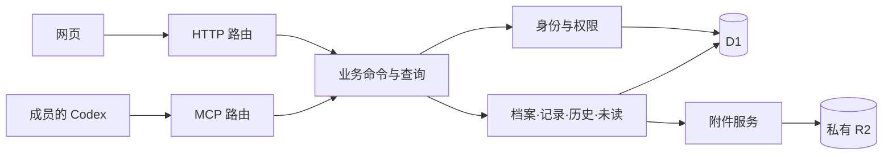

# 首版技术方案

日期：2026-09-08。依据 [PRD](./PRD.md)、[技术验证结果](./technical-validation.md)与[设计说明](./design/README.md)。技术验证代码和前端原型提供证据与设计参考，均不是生产应用。

## 技术选择

| 部分 | 选择 | 原因 |
| --- | --- | --- |
| 网页 | React + TypeScript + Vite，应用自带核心静态资源 | 内部工具无需 SEO；可直接落实已审阅的组件和响应式布局 |
| 运行入口 | 一个 Cloudflare Worker，Hono 负责 HTTP 路由 | 网页接口、认证图片与 MCP 同域，减少分散部署和跨域问题 |
| 数据 | D1，参数化 SQL + 版本化迁移 | 关系、作者、版本、负责人和事件适合关系模型；原子 batch 已实测 |
| 附件 | 私有 R2，元数据和引用位于 D1 | 二进制与关系数据分离，历史版本共用不可变对象 |
| 网页认证 | 本系统账号密码 + 不透明服务端会话 | 符合管理员建号、冻结和无需外部登录的需求 |
| 密码 | 原生 scrypt，保存算法版本、参数、随机盐和派生值 | 云端已验证可运行；不降低密码存储强度来适配 PBKDF2 限制 |
| MCP | Streamable HTTP，无状态 `createMcpHandler`，个人 Bearer 凭证 | 当前操作不依赖长驻 Agent 状态；真实 Codex 路径已验证 |
| 部署 | GitHub Actions 检查后部署 main；测试数据独立 | 控制迁移顺序与验收检查，避免开发覆盖生产 |

正式运行按 Workers Paid 所需能力设计；账号现有套餐及实际增量费用在部署前确认。React/Vite 原型已实际构建并在浏览器运行，参见 [原型](../prototypes/frontend/)。Workers 对 [React + Vite](https://developers.cloudflare.com/workers/framework-guides/web-apps/react/)有官方集成路径；具体集成在首条实施切片中固定版本。

### 已确认的开工条件（2026-09-08）

- 正式版本 v0.1.0，正式域名采用用户确认的 `scout.dapaidang.org`，不继续检查域名候选。测试环境默认使用独立的 `scout-staging.dapaidang.org` 或隔离 workers.dev 入口，不混用数据。
- 本机 Wrangler OAuth 已确认具备 Workers 和 D1 写权限，数据库创建、迁移、管理员初始化及部署可直接通过 CLI/API 完成，不依赖浏览器操作数据库。
- 用户已授权由 Agent 初始化管理员；默认账号名 `admin`，随机临时密码、只存哈希、首次登录改密，交付凭证通过私有方式，不进源码、Issue 或请求日志。
- GitHub 仓库维护权限可用，#1–#14 已发布并归入首版里程碑；仓库尚无 Cloudflare CI 部署凭证。本机登录与 GitHub Actions 是独立认证，正式自动部署仍须配置限定用途的凭证，不能把本机 OAuth 复制为长期 CI 秘密。
- 当前 OAuth 无法读取订阅账单，不能据此判定账号为 Free 或 Paid；新开付费订阅仍待费用授权。该条件不阻止本地实现与无需新增付费的工作，遇到实际付费步骤再按授权范围处理。

## 业务边界

首版保持一个部署单元，按责任组织模块：

- **身份与账号**：确认成员、创建/撤销凭证、登录与密码、冻结/解冻、角色变更、最后管理员保护。
- **档案与观察**：人物/组织、合法状态、多人负责人、关闭/开启、记录及可恢复删除。
- **附件**：签发上传票据、校验上传、绑定版本、认证读取、暂存清理及首版头像来源。
- **动态与阅读**：不可编辑的事件、个人未读和已读状态、活动排序及分页查询。
- **标签与词库**：分库类别/定义、绑定/依据、重点展示、影响预览、合并与关闭快照；共享来源可见性查询。

HTTP 和 MCP 只做协议输入、身份入口和结果转换，调用同一批业务命令。身份、关闭限制、作者判断和幂等不能各自再实现一份。使用明确的输入/输出和错误类型，不预先建设插件系统、通用工作流引擎或多云适配层。

## 数据模型

| 集合 / 表 | 核心内容 |
| --- | --- |
| members | 稳定 ID、账号、显示名称、角色、冻结状态、认证 epoch、创建时事件边界 |
| password_credentials | 算法版本、盐、参数、派生值、须更换临时密码标记 |
| sessions / personal_tokens | 只存高熵令牌的哈希、成员、epoch、期限、撤销信息 |
| entities | 类型、名称、头像来源、业务状态、关闭状态、最后开启类状态、version、活动时间 |
| contacts / links | 所属档案、类型、值、备注；QQ 为可选联系方式 |
| entity_responsibles | 档案 + 业务状态 + 成员；不把多人关联拼成字符串 |
| observations | 稳定记录 ID、档案、原始作者、当前版本、创建时间、可选观察发生时间、删除状态 |
| observation_versions | 版本、正文、操作者、操作时间；旧版本不可覆盖 |
| attachments / version_attachments | 不可变对象键、哈希、类型、大小、上传状态；各版本的附件引用与顺序 |
| events / event_reads | 行为序号、档案、操作者、来源、变化前后值；成员自己的阅读标记 |
| commands | 成员、request_id、标准化输入摘要和最终结果，用于写入重试 |
| tag_categories / tag_category_versions | 所属实体类型、稳定 ID、规范名称、预设颜色、可选描述、停用状态、版本及历史 |
| tags / tag_definition_versions | 所属库与类别、名称及规范键、必填描述、版本、停用/合并指向；历史保留类别名称与词义 |
| entity_tags / tag_binding_history | 档案与标签、当前有效状态、添加/确认者与时间、重点顺序、绑定版本、增减和迁移历史 |
| tag_evidence | 绑定来源种类、观察及版本引用或独立明确说明；来源派生说明与引用一同鉴权，不复制为无来源公开字段 |
| entity_tag_snapshots / tag_library_events | 关闭时的定义/绑定/依据快照引用；词库维护差异、操作者和事件；快照不豁免来源读取权限 |
| agent_tasks / mcp_calls / call_payloads | 任务说明与来源种类、明确任务关联、每次调用和实际结果、筛选后的业务参数或受控引用及到期时间；不存认证秘密 |

数据库使用约束和索引落实稳定身份、引用和版本。头像没有独立的账号身份含义，人物与成员也不因 QQ 相同自动归并。正式表名可调整，以上是责任边界。

## 写入与并发

每个会影响内容的命令包含 `request_id`；编辑现有对象同时提交 `expected_version`。输入先通过共享 schema 校验，请求 ID 使用 UUID，版本必须是有效整数。相同成员以同一请求 ID 和同一输入重试，返回首次成功结果；复用 ID 却改变输入返回冲突。

成员有效性、角色、作者、关闭状态与版本前提必须在同一个 D1 原子 batch 内再次检查，再写入内容、历史版本、事件、活动时间和幂等结果。验证中使用失败即触发 CHECK 回滚的 guard，已证明前面执行过的写入也会撤销；参见 [D1 batch 语义](https://developers.cloudflare.com/d1/worker-api/d1-database/)。正式实现可沿用这种方式并封装在持久化模块内。

前置查询用于给出友好的 403/404/409 信息，不能替代事务内复核。数据库不可用等意外故障应归为服务错误，不像 spike 一样把所有写入异常都简化成 409。

状态没有顺序。开启档案可以直接切换至任一合法状态；关闭类状态的变更与关闭事件一起写入。关闭后仅接受显式 `reopen` 命令及读取，不能借普通字段更新改变状态。重新开启与选择开启类状态一起完成。没有实际变化的保存不产生新版本、活动或未读。

第一版身份检查使用主库结果，不引入最终一致的授权缓存。若未来开启读副本，身份/撤销与写入前提仍必须保持主库一致性。

## 登录、会话与个人凭证

- 密码记录携带算法和参数，以便以后升级。当前方案为 scrypt `N=32768,r=8,p=3`；高成本操作之前执行账号/IP 限速，并限制单个 isolate 中同时运行的 KDF 数量。
- 登录生成高熵会话，Cookie 使用 HttpOnly、Secure、SameSite=Lax、Path=/；数据库保存令牌哈希。Cookie 写入请求验证 Origin，并防止跨站请求伪造。
- 冻结、密码重置或明确的全部撤销推进认证 epoch；旧网页会话、个人 MCP 凭证和上传票据均失效。解冻不会恢复旧令牌。
- 个人 MCP 凭证独立命名、只展示一次明文、可撤销；后续列表只展示非敏感标识。网页接入说明与明文凭证分开。
- 管理员初始化是一次性的私有管理步骤，不提供可长期匿名调用的建号入口。首登更换临时密码之前只允许完成该操作及退出。
- 账号管理动作审计；事务内保证至少一名未冻结管理员。界面隐藏管理员入口不能替代权限检查。

实际登录并发、限速、时限与首登流程在第一条实施切片验收，不沿用 spike 的预置 Cookie 作为生产登录实现。

## 图片与历史版本

1. 网页或 MCP 提交档案 ID、图片类型、字节数和 SHA-256，申请短期上传票据。
2. 票据绑定上传成员、认证 epoch、档案、对象键和预期内容。固定上传地址；不接受任意远程 URL 抓取。
3. 上传端点检查大小、文件实际类型、哈希、有效期与当前权限，再保存到私有 R2。写完后再次确认账号与档案仍允许写入，才将上传状态标为可引用。
4. 创建/编辑记录时，在同一业务事务内将已上传附件绑定到新的记录版本。旧版本引用保持不变。
5. 图片读取必须经过当前成员鉴权，并复核关联记录当前删除状态：他人已删除内容的图片与历史附件不向普通成员返回；只保留作者/管理员访问。不返回会在账号冻结后继续公开有效的长期签名读取链接。浏览器返回 private/no-store，服务端可对不可变对象做不绕过鉴权的缓存。

首版实施默认上限：单图 10 MiB、每条记录最多 10 张；PNG、JPEG、WebP，静态图片优先。服务端检查真实类型、读取上限与超时，不能只相信客户端 MIME。列表采用懒加载，完整图片按需打开。

R2 与 D1 不是同一个事务。使用“不可变上传对象 → 验证通过 → 版本引用”的顺序，失败可能留下私有暂存对象；定期只清理超过期限且没有任何历史版本引用的暂存物。删除观察记录绝不删除被版本引用的图片。

QQ 头像沿用 makeshift-dev 的本域代理与过期缓存思路；在本系统通过成员/档案标识鉴权，使用私有缓存。人物与成员头像按有效上传图、QQ 缓存、默认形象依次回退；组织只有上传图与默认形象。存在有效上传图时不发起 QQ 读取，也不由 QQ 刷新覆盖上传图；移除上传图后重新按 QQ 缓存新鲜期取图。QQ 与人物/成员身份不互相推断。

上传头像使用独立用途的私有附件标识，票据绑定档案或成员 ID；普通成员只能修改自己的账号头像，可按既有权限修改开启档案的头像。服务端校验用途、真实图片格式、大小、主体权限及关闭/冻结状态。客户端预览用对象 URL，不把本机路径或对象 URL 写入正式持久数据。替换/移除头像与 QQ 备用值分开保存，避免移除上传图时误删联系方式。

## 查询、动态与未读

列表按内容活动时间和稳定 ID 排序，使用游标分页，默认每页 30 个档案。查询同时返回近期少量观察摘要，避免列表逐条请求。详情默认加载 30 项动态，长历史和版本另取；不一次返回档案全部历史图片和全文。

独立的 D1 读取尽量在一个 batch 内完成，减少跨境往返；搜索首版采用经过限长、参数化的名称/记录内容检索，实际规模和慢查询决定是否增加索引方案。数据量扩大时优化持久化实现，不改变业务入口契约。

未读以事件为边界，排除当前成员自身动作，并从成员创建后的事件开始。前台页面在对应内容实际展示后自动批量回报已展示的事件 ID 和版本边界，只改变当前成员阅读进度；未加载、后台、失败或无权限内容不确认，无手动已读按钮。使用可见性检测和短暂防抖，记录卡片过长时以其正文阅读入口/起始内容进入视口为边界，不要求全文同时可见；后台采用幂等写入，不改活动时间。记录后续被编辑会产生新的未读更新。系统事件在界面上保持轻量，记录内容为主。

## MCP 契约

工具按照业务动作拆分：确认身份、查询/创建档案、修改资料与负责人、变更状态、关闭/开启、图文记录与版本、删除/恢复、标签库与绑定维护、未读和账号管理。读写范围以该成员网页权限为边界。

输入输出使用稳定 ID；写入工具说明明确请求 ID、预期版本、关闭与作者限制，成功返回对象链接和新版本。图片采用已验证的短期 PUT 票据路径，避免在 MCP JSON 内搬运大段 base64。接入提示词说明客户端需要具备本机文件读取和 HTTP 上传能力。

采用官方 [无状态 MCP handler](https://developers.cloudflare.com/agents/model-context-protocol/apis/handler-api/) 的每请求 server factory，不为当前 CRUD 场景引入 Durable Object。客户端凭证通过 `bearer_token_env_var` 配置；仓库和复制的通用提示词不保存用户明文令牌。

## 部署、数据恢复与验收

标签的新增结构与契约见本文末尾标签实施补充及 [标签系统](./tag-system.md)；不是既有探针已实现或验证的能力。正式上线与恢复验收必须包括标签定义版本、绑定来源、合并映射和关闭快照。

正式入口拟为 `scout.dapaidang.org`，绑定前检查占用。Worker 静态资源配置明确区分页面与 `/api`、`/mcp`、`/images`、`/uploads`，API 错误不回退为 SPA HTML。

main 的部署工作流按“依赖安装与检查 → 构建 → 测试迁移 → 生产前置备份 → 兼容性迁移 → Worker 部署 → 冒烟检查”执行，并串行化生产部署。开发分支仅验证或使用独立 staging，不复用生产数据。

迁移采用先扩展、后迁移、最后移除的方式；代码回退不意味着数据库可以任意逆向回退。禁止通过清空数据库恢复部署。部署 token 使用项目所需的最小 Cloudflare 权限并保存在 GitHub Secrets；本机 OAuth 不复制到仓库。

利用 D1 [Time Travel](https://developers.cloudflare.com/d1/reference/time-travel/)提供的恢复能力，并计划每日把数据库导出到独立私有备份位置，备份不进入公开仓库或公开 CI 制品。R2 中被历史版本引用的图片不作自动过期处理；数据库备份与图片对象清单共同构成恢复材料。上线前至少在隔离环境完整恢复一次，核对账号、档案、版本与图片引用。

普通运行日志只记录请求 ID、操作名、耗时、错误分类与必要主体 ID，不记录密码、凭证、正文、QQ 号或上传票据。另在私有应用存储建立 [MCP 请求留存](./mcp-request-data.md)，保存筛选后的业务参数、任务上下文与实际结果，用于需求分析；不存原始认证头，详情与来源沿用读取限制，按期限清理。配置用量告警及单请求 CPU 上限，预算以真实套餐和观测值确认。

生产验收必须覆盖：真实密码登录/冻结、网页和 Codex 图文闭环、关闭与作者权限、历史恢复、不同成员未读、正式域名大陆无代理核心操作、备份恢复。当前原型及 spike 不能代替这些生产验收项。

## v1.2 审阅修订

2026-09-08 用户审阅后：移除别名与简介；人物三个工作状态与组织“组织交流”必须绑定至少一名负责成员；其他状态可选关联。只展示当前状态成员，旧关联保留在历史；选择采用搜索下拉。状态与绑定在同一事务中校验，HTTP/MCP 共用规则，禁止客户端先存工作状态后补成员。

删除可见性属于读取权限变化，必须在服务端查询记录、版本、搜索摘要、未读内容和附件时统一限制。不能仅在前端隐藏卡片；历史图片 URL 同样复核当前记录状态，不把含正文的事件副本泄露给无权成员。旧 v1.1 云端报告不覆盖这项新规则，已补本地验证，正式实现仍需云端复验。

## v1.3 交互实施补充

Agent 接入主页面只承担使用说明与复制提示词。复制内容负责配置、临时/持久选择与核验，业务规则和材料整理指南由 MCP 提供；个人凭证生命周期在猎头账号连接管理中完成。这不改变每请求认证或权限边界。

第三版原型新增的草稿、筛选和阅读位置均保存在 React 内存中，按成员及页面/档案隔离；没有自动同步或刷新恢复能力。正式草稿存储须明确保存/失败状态、退出清理与附件寿命，不能直接把敏感档案材料无期限写入共享浏览器存储。服务端阅读进度仍使用事件及版本幂等确认。

搜索返回命中记录标识及可见摘要，让客户端直接定位；查询仍需执行删除读取权限。未读页本次队列保留已阅条目位置，下一处未读定位优先于普通滚动恢复。跨档案跳转须处理分页和目标不可见/已删除情形。第三版原型仅验证内存数据下的交互，不代表分页及云端查询已完成。

MCP 工具描述必须主动引导收集可选资料：从已给材料提取联系方式/QQ、关联成员、来源和附件；有用的缺失项可以简短提醒或追问。工作状态缺负责人返回明确业务错误，说明需要查询成员并请用户指定，不能悄悄默认调用者。非工作关联可空，不因资料不全拒绝所有创建。

## 标签实施补充（PRD 文档修订 1.5 引入）

产品规则以 [标签系统](./tag-system.md)为准，词汇种子以 [初始词库](./tag-catalog.md)为准。网页/MCP 共用模块，不引入向量库、后台自动打标或独立 Agent 服务。此处记录待实现方案，不修改旧验证报告的通过范围。

1. 库类型和类别/标签/档案关系使用约束校验；规范键落实类别唯一、同类标签唯一和有效绑定唯一。名称规范化先执行统一全半角与拉丁大小写规则，保留展示值；并发重复创建返回既有 ID 或明确冲突，不能覆盖不同描述。
2. 词库修改使用定义 `expected_version` 和影响预览条件。预览由服务端生成不可伪造或服务端存储的短期标识，绑定成员、具体操作、前后值及标签/类别/绑定集合版本；提交事务内复核，有新增/移除绑定或对象版本变化即冲突。可见影响结果分页返回，不能把隐藏依据带入预览或日志。影响预览不是人类审批令牌。
3. 绑定操作携带档案版本，事务内复核成员有效性、关闭状态、标签/类别可用性和库类型，再写绑定/依据/事件/活动时间/请求结果。多项整理生成一条带明细事件；无变化不生成活动。主体授权和重试语义沿用既有写入契约。
4. 定义修改仅追加不可变版本与词库事件；开启档案查询当前定义，档案历史按事件引用当时定义。关闭命令在同一事务中记录标签快照；重新开启比对当前词义并返回差异。停用或已合并标签不自动换绑。类别更名历史可重放，不只存当前类别外键。
5. 合并按显式选定的开启档案迁移，事务内检查当前权限/关闭/版本；目标已有绑定时保留目标、汇总可读依据来源并去重，历史不丢。首版按有上限的分页批次执行，预览列明批次；已完成批次与未完成项分别报告，不把部分完成标成全局成功。源标签停用与迁移策略明确，关闭引用及未选引用仍可指向旧定义。
6. 来源读取条件必须参与数据库查询和聚合，不能先按隐藏标签筛选再在输出里删字段。标签、依据、绑定计数、筛选命中、重点、历史事件、未读和 MCP 使用同一可见性约束；删除/恢复来源立即影响派生可见性。快照中保留来源引用，不把当时可读视为永久可读。独立依据与派生依据分别存储和鉴权；未知来源不能由后台自动补成独立材料。
7. 词库查询分页返回描述、版本、状态与当前成员可见绑定数；读取绑定可按开启/关闭分组。索引覆盖库/类别/规范名、档案/标签有效绑定、来源记录、重点排序；数据规模再决定搜索优化，第一版无需语义检索。
8. 验证覆盖 [产品验收矩阵](./tag-system.md#8-验收与首版边界)及真实 Codex 材料压缩、查库复用/创建、绑定、更名预览、按权限合并、删除来源后的读取。正式 schema、批次上限、错误码在 S11/S12/S14 固定并记录证据，不能引用旧删除套件作为标签已通过的证据。
